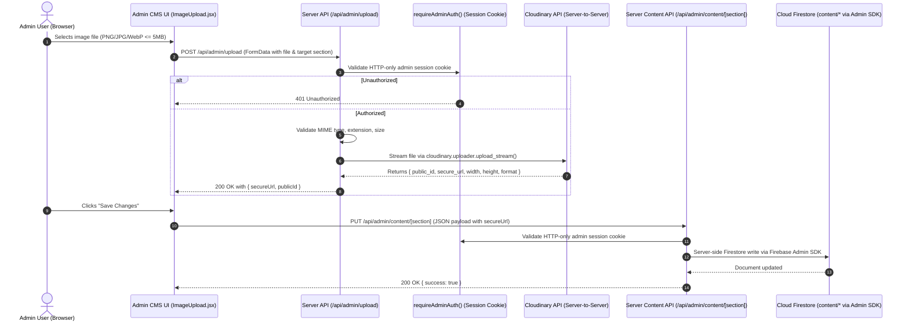

# Cloudinary Image Infrastructure & CMS Asset Architecture

> **Status:** PHASE 1 SPECIFICATION (UPDATED WITH ALL REVIEW CORRECTIONS — AWAITING EXPLICIT APPROVAL)  
> **Document Version:** 3.1.0 (Strict Server-Side Mutation, Zero-Default & Scoped Asset Model)  
> **Target Scope:** Media Storage, Cloudinary Upload Pipeline & Canonical Asset Schema  
> **Core Principle:** DATA EXISTS → SHOW DATA. DATA DOES NOT EXIST → EMPTY. Zero client credentials. Server-side mutations only.

---

## 1. Executive Summary & Core Rules

### Absolute Architectural Rules

1. **The Strict Binary State Rule**:
   - **STATE A — DATA EXISTS**: Firestore contains actual saved asset references $\longrightarrow$ UI displays that asset.
   - **STATE B — DATA DOES NOT EXIST**: Firestore document or field does not exist $\longrightarrow$ Admin form displays an **EMPTY** state (`""`).
   - **NO THIRD STATE**: Zero default values, zero template seeding, zero fallback content in Admin, and zero fake placeholder previews.
2. **Server-Side Mutation Flow (No Client-Side Firestore Writes)**:
   - Due to deny-by-default Firestore security rules (`allow read, write: if false;`), the browser must **NEVER** write directly to Firestore.
   - All asset uploads and document updates are executed entirely through authenticated Next.js server-side endpoints protected by the existing `requireAdminAuth()` session-cookie guard.
4. **Local Asset Reference Policy (No Fake Pre-population)**:
   - Local `/public/...` asset paths (e.g. `/passport-picture.png`, `/about/signature.png`, `/logos/*.png`) exist strictly for local reference / optional code fallback.
   - They must **NEVER** be automatically inserted into Firestore, used as Admin form defaults, or substituted for an empty CMS asset field.
   - If Firestore has no saved asset URL, the Admin field is strictly empty (`""`).
5. **Authentic Red Signature Integrity**:
   - The authentic red signature graphic (`/about/signature.png`) remains visually untouched.
   - Script-font fallbacks (Caveat, text generators, replacement typography) are **strictly rejected**.
   - Cloudinary upload stores the exact red signature PNG asset without altering its visual presentation.
6. **Social Proof Avatar Stack is 100% Hardcoded**:
   - The avatar stack displayed in the Social Proof section (`/avatars/avatar1.jpg` – `avatar5.jpg`) is **100% static in code/local**.
   - No Firestore fields, no Admin upload controls, and no Cloudinary assets.
7. **Social Proof Client Brand Logos**:
   - Client brand logos in the horizontal marquee are CMS-managed (`content/social-proof.clientBrandLogos`) so the owner can add, reorder, or update brand partner logos as client relationships evolve.
8. **Consistent Upload MIME Type Policy**:
   - **Avatars & Signature**: Raster images only (`image/jpeg`, `image/png`, `image/webp`). Max 5MB.
   - **Client Brand Logos**: Raster images and vectors (`image/jpeg`, `image/png`, `image/webp`, `image/svg+xml`). Max 5MB.

---

## 2. Current Image Asset Audit & Classification

| Asset Path | Current Type | Consumers in Code | Classification | Proposed Strategy |
| :--- | :--- | :--- | :--- | :--- |
| `/passport-picture.png` | PNG (77 KB) | Navbar, ProfilePanel, DiscoveryCTA, Quote (self) | **CMS-MANAGED** | Single canonical upload (`content/profile.avatar`) powering all personal portrait instances across the entire site. |
| `/about/signature.png` | PNG | `AboutContent.jsx` | **CMS-MANAGED** | Direct Cloudinary upload of the authentic red signature PNG (`content/about.signature`). Zero script font fallbacks. |
| `/avatars/avatar1.jpg` – `avatar5.jpg` | JPG | `SocialProofSummary.jsx`, `AvatarStack.jsx` | **STATIC CODE ASSET** | **STAYS 100% HARDCODED IN CODE.** No Firestore field, no Admin upload control, no Cloudinary asset. |
| `/logos/*.png` (`dasmo`, `hood-verse`, `momentum`, `nexora`, `quik-shine`, `tea-sense`, `triplinq`, `verdantix`) | PNG (60–85 KB) | `SocialProof.jsx` marquee | **CMS-MANAGED** | Client brand logos for the social proof bar (`content/social-proof.clientBrandLogos`) to allow dynamic brand partner updates. |
| `/logos/svg/*.svg` (14 vector brand marks: Premiere, After Effects, DaVinci, Blender, Figma, Framer, etc.) | SVG (0.4–4 KB) | `ToolList.jsx`, `src/lib/logos.js` | **STATIC TOOL ASSET** | **STAYS IN CODE/PUBLIC.** Never upload to Cloudinary. Rendered via CSS mask-image and tool IDs from code catalog. |
| `/bitmoji-face.png` | PNG (980 KB) | `HeroFace.jsx` (Hero interactive eyes/face component) | **STATIC APP ASSET** | **STAYS IN CODE/PUBLIC.** Component-specific visual asset with interactive mouse tracking logic. |
| `/projects/*.png` / `*.jpg` | PNG/JPG | Video project fallback cards | **PROJECT MEDIA** | Handled via YouTube automated ingest thumbnail cache. Unaffected by content CMS. |
| `/favicon.png`, `file.svg`, `globe.svg`, `window.svg`, `vercel.svg` | App Icons | Next.js root metadata | **STATIC APP ASSET** | **STAYS IN CODE/PUBLIC.** System icons and site metadata. |

---

## 3. Server-Side Cloudinary Upload & Mutation Flow

```
┌──────────────┐       1. POST /api/admin/upload (FormData + Section)       ┌───────────────────────────────┐
│              │ ─────────────────────────────────────────────────────────> │                               │
│              │                                                            │ Next.js Authenticated API     │
│   Admin UI   │                                                            │ (requireAdminAuth() Guard)    │
│  (ImageUpload│                                                            │                               │
│   Component) │ <───────────────────────────────────────────────────────── │ 2. Upload stream to Cloudinary│
│              │       4. 200 OK { secureUrl, publicId }                    │ 3. Returns asset metadata     │
└──────────────┘                                                            └──────────────┬────────────────┘
       │                                                                                   │
       │ 5. Save Form: PUT /api/admin/content/[section]                                    │
       └───────────────────────────────────────────────────────────────────────────────────┤
                                                                                           │
                                                                                           ▼
                                                                            ┌───────────────────────────────┐
                                                                            │ Firebase Admin SDK (Server)   │
                                                                            │ Writes document to Firestore  │
                                                                            │ (content/[section])           │
                                                                            └───────────────────────────────┘
```



---

## 4. Firestore Asset Reference Schema

To ensure seamless compatibility with existing local paths (`/passport-picture.png`) while supporting rich Cloudinary URLs, components accept direct string URLs:

```typescript
// Example: Direct URL string in Firestore
interface ProfileDocument {
  avatar: string; // e.g. "https://res.cloudinary.com/demo/image/upload/v12345/portfolio/profile/aman-portrait.png" or "/passport-picture.png"
}
```

---

## 5. Image Reuse Strategy (Zero Duplication)

1. **Single Profile Portrait Upload**:
   - Uploaded once to `content/profile.avatar`.
   - Powering:
     - **Navbar**: Top brand capsule avatar (`32x32`)
     - **About Section**: Sticky portrait card (`aspect-12/13`)
     - **Discovery CTA Card**: Circular accent card avatar (`64x64`)
     - **Quote Section**: Philosophy author avatar (`48x48`) when `quote.type === "self"`
2. **Quote Attribution Mode**:
   - When `quote.type === "self"`: strictly uses `profile.avatar`, `profile.name`, and `profile.role`.
   - When `quote.type === "testimonial"`: allows bespoke client/guest avatar (`quote.avatar`).

---

## 6. Security & Credentials Model

- **Zero Client-Side Exposure**: `CLOUDINARY_API_SECRET` is strictly server-only. It is never prefixed with `NEXT_PUBLIC_` and never included in client JavaScript bundles.
- **Environment Variables**:
  ```env
  CLOUDINARY_CLOUD_NAME=your_cloud_name
  CLOUDINARY_API_KEY=your_api_key
  CLOUDINARY_API_SECRET=your_api_secret
  ```
- **Authentication**: All upload and content update endpoints use the existing `requireAdminAuth()` HTTP-only cookie session verification. No Bearer tokens.
- **Server Validation**:
  - Max file size: 5 MB
  - Allowed MIME types: `image/jpeg`, `image/png`, `image/webp`, `image/svg+xml`

---

## 7. Required Admin Upload Locations

| Admin CMS Tab | Target Field | Upload Component Purpose | Dimension / Aspect Guidance |
| :--- | :--- | :--- | :--- |
| **Profile & Identity** | `profile.avatar` | Upload personal portrait photo | ~1200x1300 px (12:13 or 3:4 vertical portrait) |
| **About Bio** | `about.signature` | Upload authentic red signature PNG | Transparent background PNG (~400x120 px) |
| **Social Proof** | `social-proof.clientBrandLogos` | Upload client brand logos | Horizontal logo PNG/SVG (~300x100 px) |
| **Testimonials** | `testimonials[].avatar` | Optional client avatar | Square 1:1 (~150x150 px) |
| **Viewer Reactions** | `viewer-reactions[].avatar` | Optional commenter avatar | Square 1:1 (~100x100 px) |
| **Quote** | `quote.avatar` | Optional guest avatar (only when `type === "testimonial"`) | Square 1:1 (~150x150 px) |
